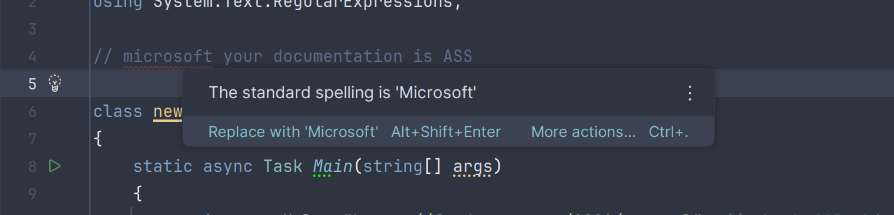

a script that parses a website's data and uses it to selectively print headlines and stuff

this was awful

devs need to create better documentation man

also you can change the website to whatever i chose NPR because it actually worked

the agent is probably useless but it took me 4 attempts at getting bbci to allow my script in before trying that and i think it's fine as it is even if the url is more open source

my source of inspiration was this: https://www.instagram.com/reel/DcB4vPgyt0g/?stkn=MXQwcm5kNnF6bWt2NQ==

